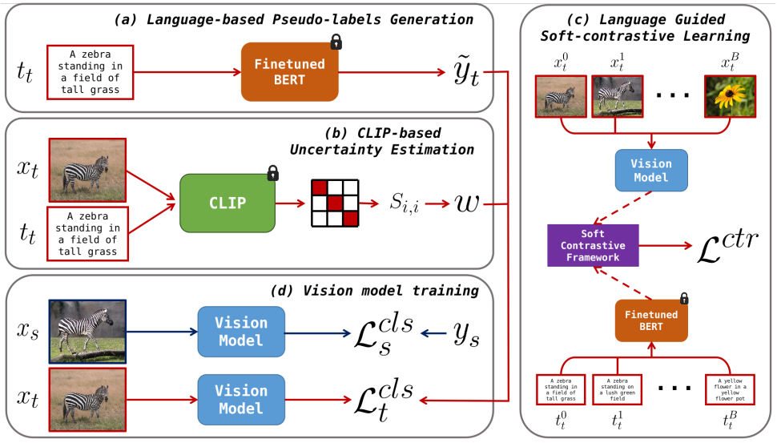
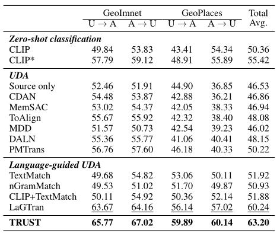
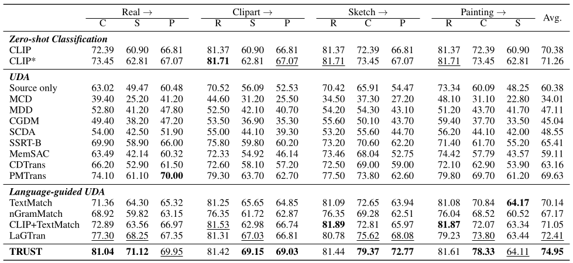

# TRUST: Leveraging Text Robustness for Unsupervised Domain Adaptation (AAAI 2026)

This is the official implementation of the AAAI 2026 paper "TRUST: Leveraging Text Robustness for Unsupervised Domain Adaptation" - Mattia Litrico, Alessio Del Bue, Pietro Morerio.

[Paper](https://arxiv.org/abs/XXXX.XXXXX)

```
@inproceedings{litrico_2026_AAAI,
  title={TRUST: Leveraging Text Robustness for Unsupervised Domain Adaptation},
  author={Litrico, Mattia and Del Bue, Alessio and Morerio, Pietro},
  booktitle={Proceedings of the AAAI Conference on Artificial Intelligence},
  year={2026}
}
```

## Abstract

<!-- TODO: Add main figure from paper (Figure 1 or Figure 2) -->
<p align="center">
  
</p>

Recent unsupervised domain adaptation (UDA) methods have shown great success in addressing classical domain shifts (e.g., synthetic-to-real), but they still suffer under complex shifts (e.g. geographical shift), where both the background and object appearances differ significantly across domains. Prior works showed that the language modality can help in the adaptation process, exhibiting more robustness to such complex shifts. In this paper, we introduce **TRUST**, a novel UDA approach that exploits the robustness of the language modality to guide the adaptation of a vision model.

TRUST generates pseudo-labels for target samples from their captions and introduces a novel uncertainty estimation strategy that uses normalised CLIP similarity scores to estimate the uncertainty of the generated pseudo-labels. Such estimated uncertainty is then used to reweight the classification loss, mitigating the adverse effects of wrong pseudo-labels obtained from low-quality captions. To further increase the robustness of the vision model, we propose a multimodal soft-contrastive learning loss that aligns the vision and language feature spaces, by leveraging captions to guide the contrastive training of the vision model on target images. In our contrastive loss, each pair of images acts as both a positive and a negative pair and their feature representations are attracted and repulsed with a strength proportional to the similarity of their captions.

Our approach outperforms previous methods, setting the new state-of-the-art on classical (DomainNet) and complex (GeoNet) domain shifts with gains of **+2.54%** and **+2.96%**, respectively.

### Data Preparation

1. Please download the [GeoNet](https://github.com/tnagaoka/geonet) dataset (GeoPlaces and GeoImNet), and put it under `${DATA_ROOT}`. By default `${DATA_ROOT}` is set to `data`. The prepared directory would look like:

```
${DATA_ROOT}
├── GeoNet
│   ├── GeoPlaces
│   │   ├── usa
│   │   │   ├── train
│   │   │   └── test
│   │   └── asia
│   │       ├── train
│   │       └── test
│   ├── GeoImNet
│   │   ├── usa
│   │   └── asia
│   └── metadata.json
```

2. Please download the [DomainNet](http://ai.bu.edu/M3SDA/) dataset, and put it under `${DATA_ROOT}`. The prepared directory would look like:

```
${DATA_ROOT}
├── DomainNet
│   ├── real
│   ├── clipart
│   ├── sketch
│   ├── painting
│   └── metadata.json
```

## GeoNet

### Training

GeoNet experiments are done for `usa` to `asia` and `asia` to `usa` adaptation on both GeoPlaces (205 classes) and GeoImNet (600 classes). Before TRUST training, we need to fine-tune a BERT model on the source domain. You may train the source BERT model with script `finetune_bert.py` as shown below. After obtaining the BERT model, you will find model weights inside the directory `logs`. Now run `train.py` to execute TRUST domain adaptation.

```bash
# Step 1: Fine-tune BERT on source domain
python finetune_bert.py \
    --root_dir data/GeoNet/GeoPlaces \
    --metadata_file metadata.json \
    --source_domain usa \
    --target_domain asia \
    --num_epochs 20 \
    --batch_size 64 \
    --run_name geoplaces_finetune_bert

# Step 2: Train TRUST
python train.py \
    --root_dir data/GeoNet/GeoPlaces \
    --metadata_file metadata.json \
    --source_domain usa \
    --target_domain asia \
    --num_classes 205 \
    --num_epochs 30 \
    --batch_size 32 \
    --run_name geoplaces_trust
```

If you want to change the default `${DATA_ROOT}`, please use the following:

```bash
# Step 1: Fine-tune BERT on source domain
python finetune_bert.py \
    --root_dir <DATA_ROOT>/GeoNet/GeoPlaces \
    --metadata_file metadata.json \
    --source_domain usa \
    --target_domain asia \
    --run_name geoplaces_finetune_bert

# Step 2: Train TRUST
python train.py \
    --root_dir <DATA_ROOT>/GeoNet/GeoPlaces \
    --metadata_file metadata.json \
    --source_domain usa \
    --target_domain asia \
    --num_classes 205 \
    --run_name geoplaces_trust
```

This will reproduce Table 2 from the main paper:

<!-- TODO: Add GeoNet results table image -->
<p align="center">
  
</p>

## DomainNet-345

### Training

DomainNet-345 experiments are done for 12 domain shifts constructed from combinations of `Real`, `Sketch`, `Clipart`, and `Painting`. Before TRUST training, we need to fine-tune a BERT model on the source domain. You may train the source BERT model with script `finetune_bert.py` as shown below. After obtaining the BERT model, you will find model weights inside the directory `logs`. Now run `train.py` to execute TRUST domain adaptation.

```bash
# Step 1: Fine-tune BERT on source domain
# example: python finetune_bert.py --source_domain real --target_domain clipart
python finetune_bert.py \
    --root_dir data/DomainNet \
    --metadata_file metadata.json \
    --source_domain <SOURCE_DOMAIN> \
    --target_domain <TARGET_DOMAIN> \
    --num_epochs 20 \
    --batch_size 64 \
    --run_name domainnet_finetune_bert

# Step 2: Train TRUST
# example: python train.py --source_domain real --target_domain clipart
python train.py \
    --root_dir data/DomainNet \
    --metadata_file metadata.json \
    --source_domain <SOURCE_DOMAIN> \
    --target_domain <TARGET_DOMAIN> \
    --num_classes 345 \
    --num_epochs 30 \
    --batch_size 32 \
    --run_name domainnet_trust
```

If you want to change the default `${DATA_ROOT}`, please use the following:

```bash
# Step 1: Fine-tune BERT on source domain
python finetune_bert.py \
    --root_dir <DATA_ROOT>/DomainNet \
    --metadata_file metadata.json \
    --source_domain <SOURCE_DOMAIN> \
    --target_domain <TARGET_DOMAIN> \
    --run_name domainnet_finetune_bert

# Step 2: Train TRUST
python train.py \
    --root_dir <DATA_ROOT>/DomainNet \
    --metadata_file metadata.json \
    --source_domain <SOURCE_DOMAIN> \
    --target_domain <TARGET_DOMAIN> \
    --num_classes 345 \
    --run_name domainnet_trust
```

This will reproduce Table 1 from the main paper:

<!-- TODO: Add DomainNet results table image -->
<p align="center">
  
</p>

### License

GNU GENERAL PUBLIC LICENSE Version 3, 29 June 2007
Copyright © 2007 Free Software Foundation, Inc. http://fsf.org/
